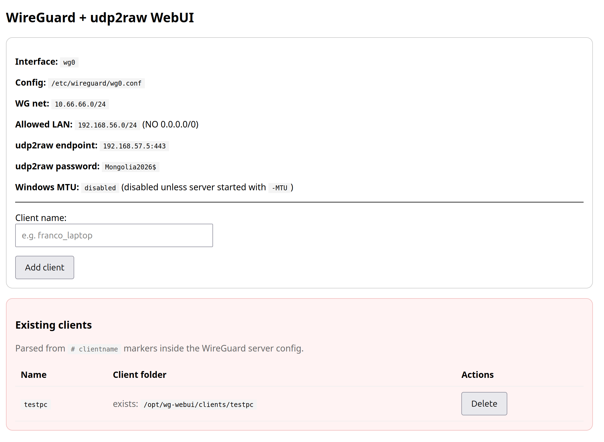
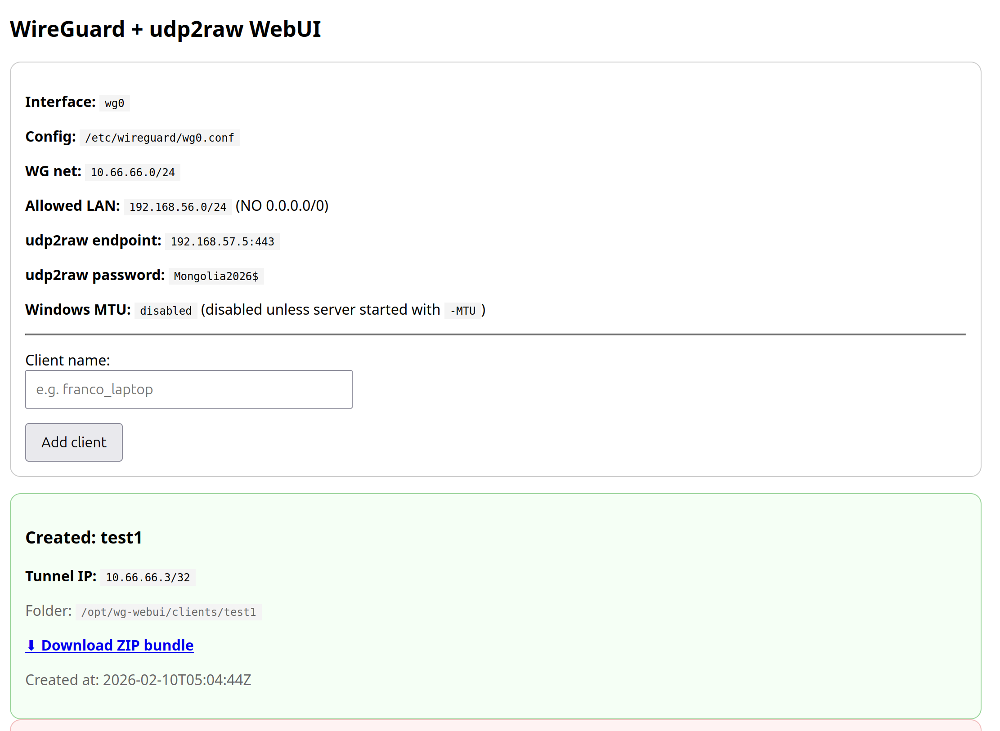

# Wireguard & udp2raw GUI
## Description
This project allow you to install and configure a Wireguard server intergrated with udp2raw to dodge censorship filters and firewalls.

From the webUI you can add and delete clients very easily.
After client creation it will provide a Download ZIP bundle to automatically configure Windows (one-click install)


## How to install on Ubuntu Server
### Compile WebUI
This part is written in go, so you will need Go compiler installed.
On Ubuntu:
```
sudo add-apt-repository ppa:longsleep/golang-backports
sudo apt update
sudo apt install golang-go -y
```
Then build the project
```
go mod init WgWebUI
go mod tidy
go build -ldflags="-s -w" -trimpath wg_GUI_udp2raw_MTU.go
```

### Install the system
- Copy wg_GUI_udp2raw_MTU and install_wg_with_udp2raw.sh on the target Ubuntu Server
- Run as root ./install_wg_with_udp2raw.sh
- Complete the installation, the script will install and configure: wireguard, udp2raw and the webUI
- reboot
- You will find the webUI at http://your server IP

### Install a client
- Navigate to the webpage
- Set the client name and click on "Add client"
- A green box will appear on the bottom. Click on "Download ZIP bundle"

- Copy the ZIP file to the target client
- Unzip the downloaded file
- If it's a Windows OS right click on "install.ps1" - Run with powershell
